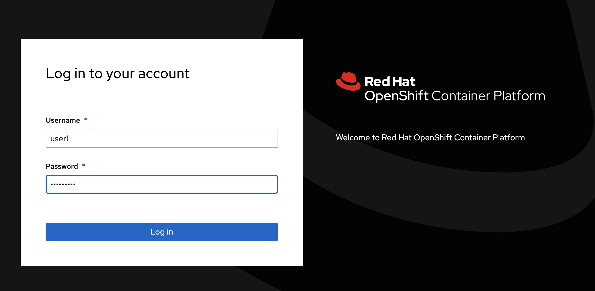
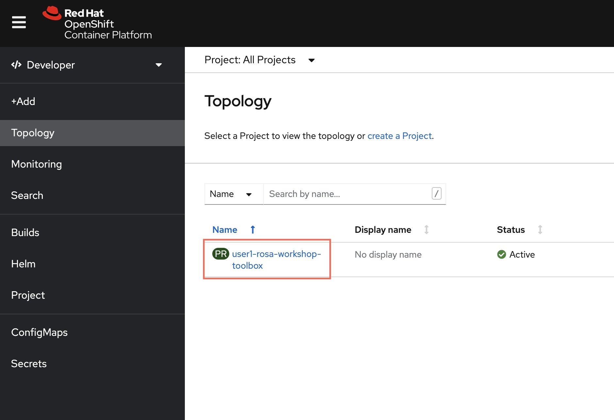
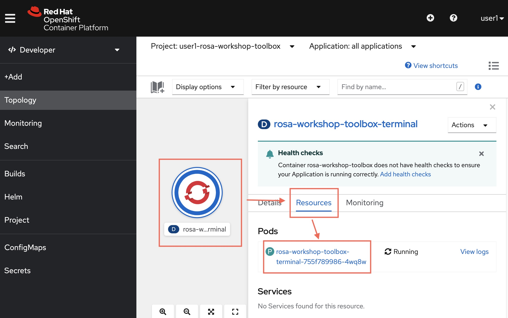
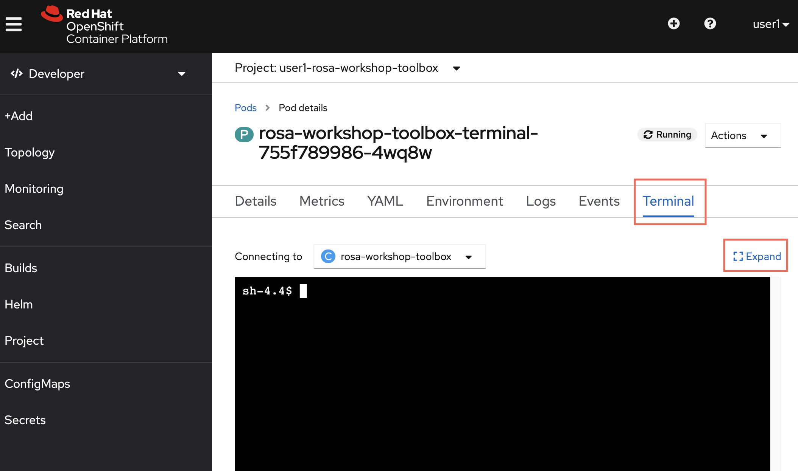

## Access your lab toolbox environment

Since we would like to streamline your hands-on workshop experience with having trouble installing tools and setting up the dirty works, we have pre-installed all the necessary tools for you. F

For each participants attending this workshop, we will be give you a web-based, containerized terminal for you to type commands and do you exercises throughout all the labs. Besides, we have created some AWS and Red Hat accounts for you to work on the labs, so you DON'T need to use your own AWS or Red Hat account in this workshop.

### How to access the web-based terminal?

- 1. Open your browser, visit https://red.ht/hk-rosa-lab-cluster.

- 2. You will be asked to login. Each participant will be given a username and password by the instructor. Please use those for login. (**Important: remember what your username is. Username is equal to User ID in this workshop. A lot of work that we are going to do needs you to input this User ID to prevent naming conflicts with other participants.**)

    

- 3. Once logged in, click the `<your-user-id>-rosa-workshop-toolbox` link.

    

- 4. Click the circle in the middle (which is the containerized web-based terminal app), then click `Resources`, then click the pod's name.

    

- 4. Click `Terminal`, then click `Expand` to make the terminal windown fullscreen.

    

That's all. You are ready to go! You may start your workshop and begin the journey!