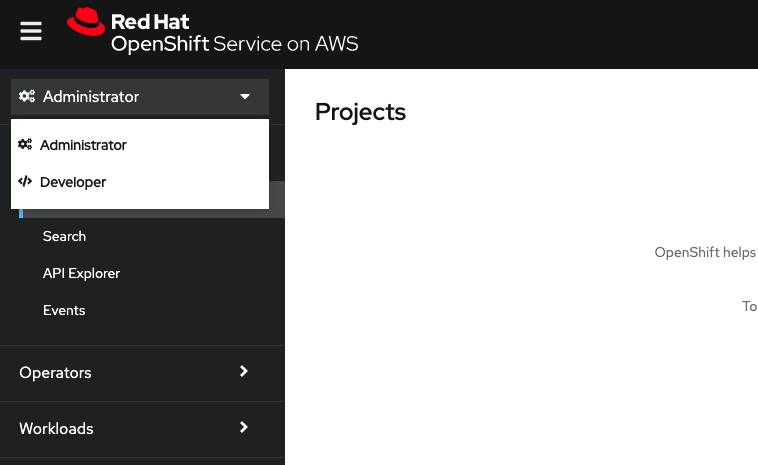
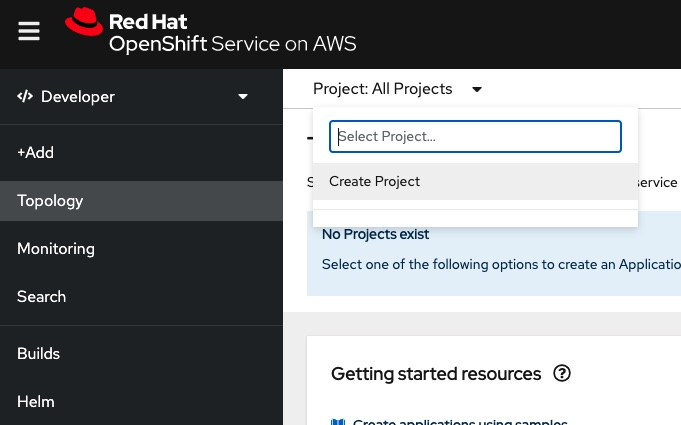
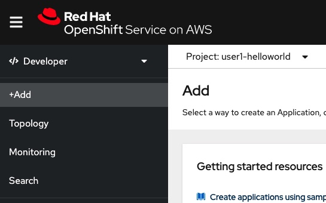
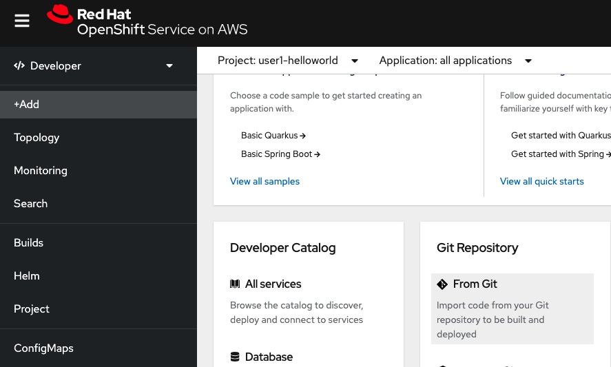
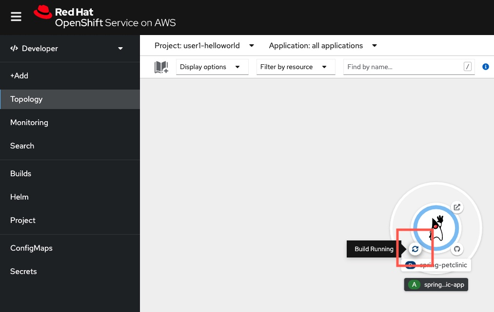
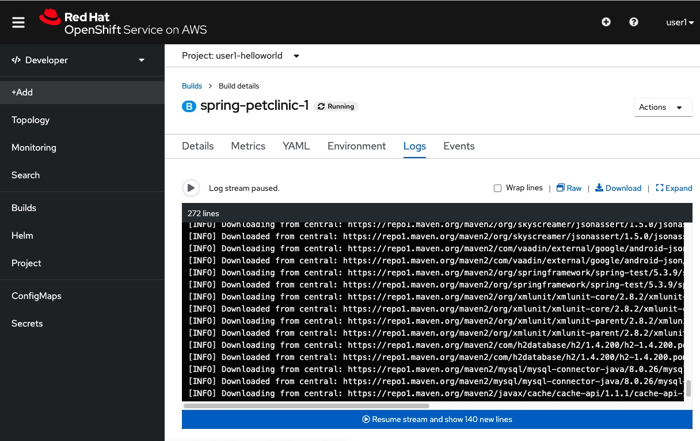
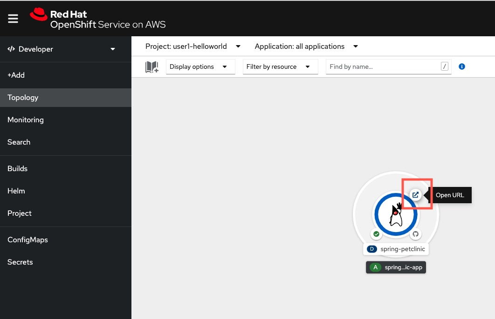
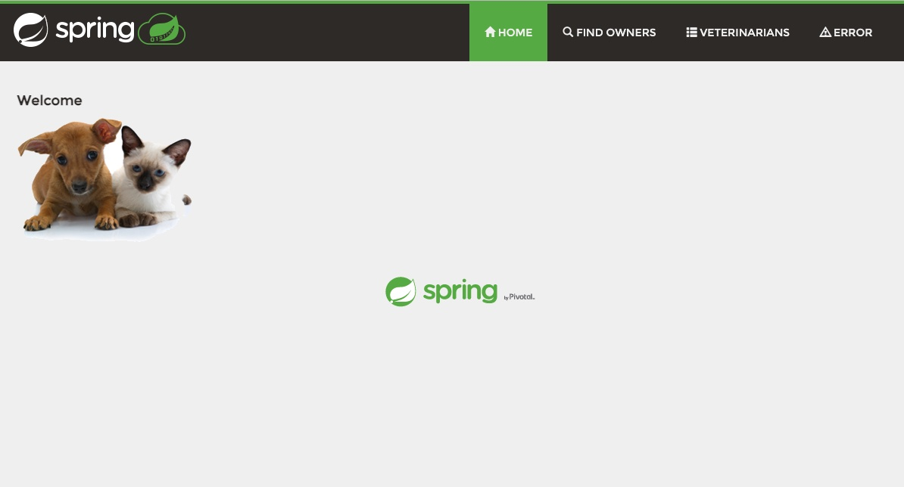

## Deploying application as container on OpenShift directly from source code using source-2-image (S2I)

In this section, we will directly deploy a sample Spring Boot application, without any Docker knowledge via a specialized tool in OpenShift called S2I.

### 1. Creating a new project (same as Namespace in Kubernetes)

Click the arrow icon down below the top-left OpenShift logo in your OpenShift web console, then select `Developer` to view the console in a developer-focused view.

Right next to the `Developer` view button, click the `Project` button arrow, then click `Create Project`.

In the name field, please enter:

    <your-userid>-helloworld
    
For example, if your user ID given is `user1`, then please enter `user1-helloworld`. And then click `Create`.

> <b>WARNING: Please replace <your-user-id\> with the user ID given by your instructor. DO NOT user other names to prevent naming conflict with other participants.</b>

### 2. Deploy a sample Spring Boot app

Click the `+ Add` button.

In this page, you can deploy applications using different methods, for example

1. Using Git repo to directly deploy apps without writing a Dockerfile
2. Using Dockerfile in your Git repo, and let OpenShift build and deploy the container image for you
3. Using Kubernetes (K8S) YAML in case you already has written the application definition (called manifest)
4. You can even upload your Java JAR directly without building a container image! (OpenShift can help to package your JAR into a container image for you)
5. Deploy sample applications, databases, and some third-party applications or solutions via Operator framework or Helm chart

Down below, click "From Git" button, and enter the followings:

- Git Repo URL: `https://github.com/spring-projects/spring-petclinic`
- Builder Image version: `openjdk-11-el7`
- Name: `spring-petclinic`
- Resources: Select `Deployment`
- Advanced options: Check the `Create a route to the Application` box

When done, click `Create` button.

It will trigger an OpenShift S2I image build process. In short, it does the followings:

1. Start a builder pod (a pod is a group of containers, but usally it is a single container. Pod is a Kubernetes term) inside OpenShift
2. Clone the Git repo into the builder pod
3. Use the `openjdk-11-el7` as the base image, inject the Git code into the base image
4. S2I automatically detected it is a Java Spring Boot app with a pom.xml file, then will will follow the normal procedure to run maven build and execute the app.
5. Package the built app into the container image
6. Push the built image into OpenShift internal container registry
7. Automatically write K8S YAML configurations to run your app on OpenShift

> S2I is a great tool for developers who doesn't know Docker and Kubernetes command very well. The S2I image build process above can be cusotmized too, although we will not cover this in today's workshop as it is an advanced topic.

### 3. Verify the result

Now, back to the Developer view. (Hint: You may check the `Topology` button on the left in case you are lost).

Click the little icon at the <b><u>bottom-left</u></b> of your application logo. This will send you to view the S2I build pod logs.

You will see a black logging screen. Depending on how fast your work is, it will either shows `Push successful` at the end of the logs, or still processing.

> The build process takes a couple of minutes. Please wait, or you may continue to work on the next exereice in parallel.

Click the `Topology` button on the left to go back to the Developer view.

Click the little icon at the <b><u>top-right</u></b> of your application logo. This will open your application in a new URL.

Congrats! You have successfully deployed the application, and now with a URL exposed outside to OpenShift.

> Tips: Since our lab environment is exposed to the public Internet, thus the URL that we create also exposed to the Internet. However, ROSA can be created privately with the use of AWS Private Link. In that case, your ROSA will not have any public-facing endpoints and completely isolated from the Iternet.