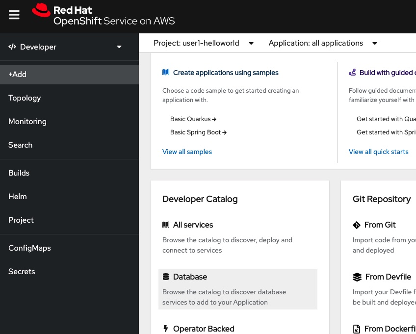
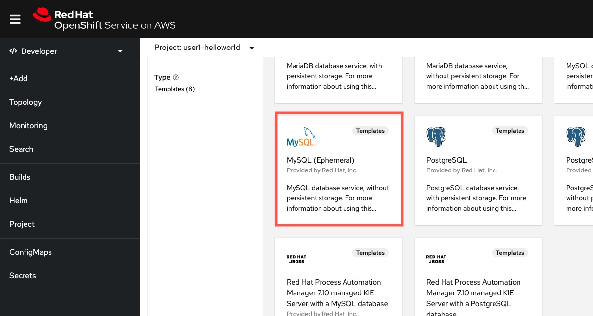
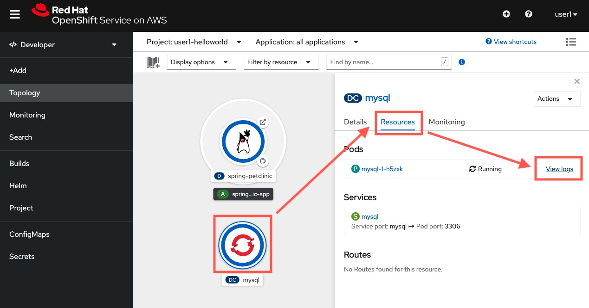
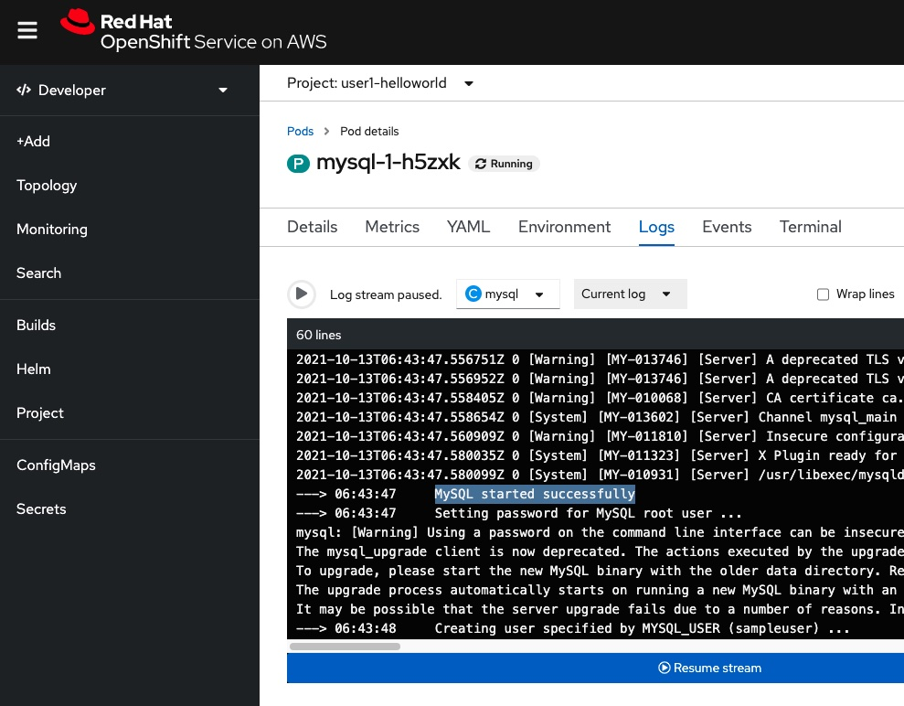
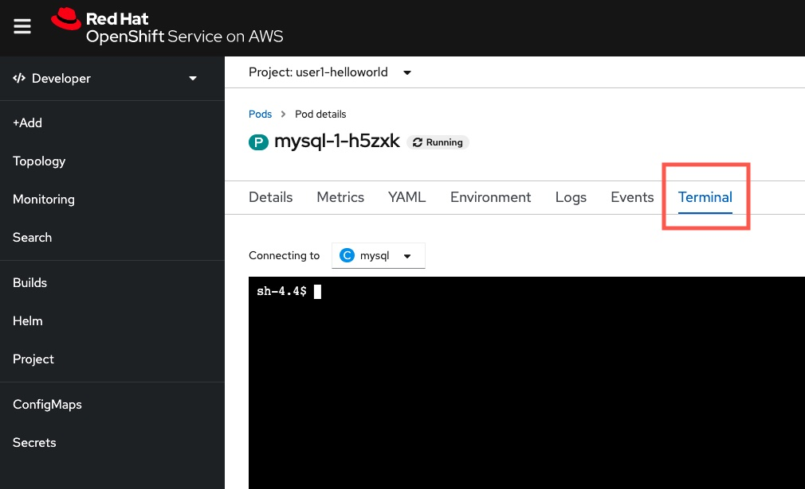
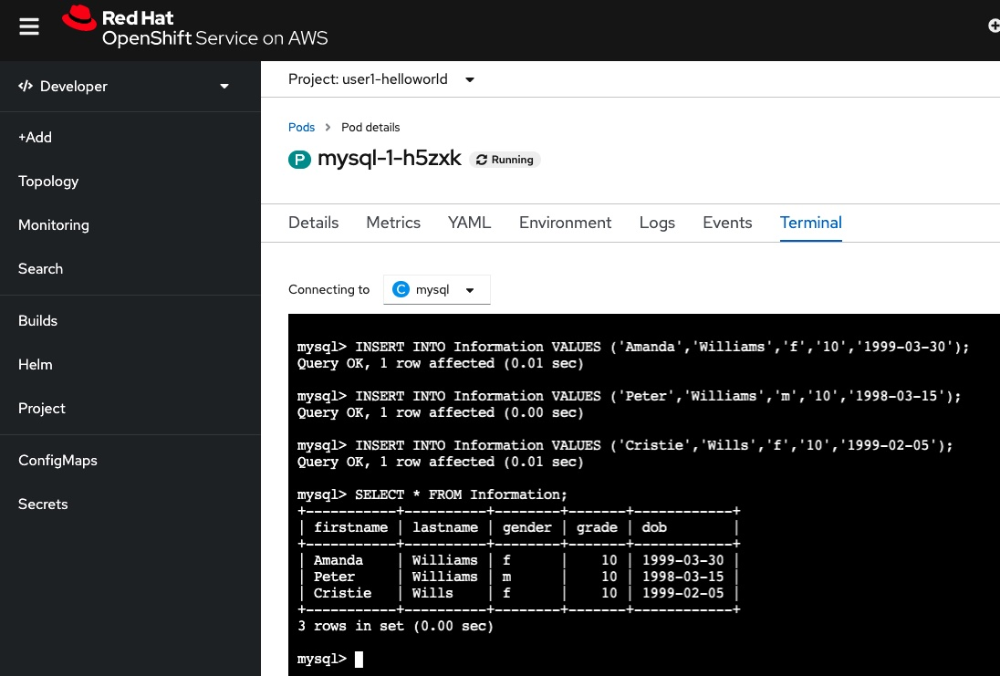

## Creating a new database just for fun

In this section, we will leverage the OpenShift's build-in open source database images to run a testing MySQL DB.

### 1. Deploy a new database

Click `+ Add` button.

This time, we will create a MySQL database just for fun. We will not link up the database with the Spring Boot app that we deploy, but here just to showcase how easy it is for you to run a sample database on OpenShift.

Down below, click `Database` button.

Click `MySQL (Ephemeral)`, and then click `Instantiate Template` button.

> WARNING: Note: Ephemeral means data storage will not persiste when the container / database restarts for whatever reasons. Thus, this <b>Ephemeral database should NOT be used in production environments!</b> We are just for jun to test this out only!

Please enter the followings:

- Namespace (the first select menu): `<your-userid>-helloworld`
- MySQL Connection Username: `sampleuser`
- MySQL Connection Password: `password`
- MySQL root user Password: `rootpassword`
- MySQL Database Name: `sampledb`

Other settings leave as defaults.

Click `Create` button.

Wait for a few moments to let OpenShift deploy and run the MySQL database.

> Hint: When the circle color around the MySQL application in the Developer view turns from light blue to deep blue color, it means the application (i.e. the database) is now ready, up-and-running.

### 2. Verify the result

Click the MySQL application cirle in the Developer view.

Click `Resources`, then click `View logs` next to the first pod's name.

Search the logs, you should be able to see `MySQL started successfully` log line inside the page. It should be around in the middle of your logs.

### 3. Try to access and use the MySQL DB

You can also remotely "ssh" into the MySQL container to do some jobs! Now, click the `Terminal` button (which is located in a list of buttons down below the Pod's name)

In the terminal, run:

    mysql -u sampleuser -p

Enter `password` when it prompts you for a password input.

You should now be able to log into the MySQL CLI. Now run the followings to test the DB (run them parts by parts to see the results):

    USE sampledb;
    
    CREATE TABLE Information (firstname VARCHAR(20),lastname VARCHAR(20),gender CHAR(1),grade INT(10), dob DATE);

    SHOW TABLES;

    INSERT INTO Information VALUES ('Amanda','Williams','f','10','1999-03-30');
    INSERT INTO Information VALUES ('Peter','Williams','m','10','1998-03-15');
    INSERT INTO Information VALUES ('Cristie','Wills','f','10','1999-02-05');

    SELECT * FROM Information;

What could you see? You should be able to see a new table has been created, and 3 rows are being inserted into your MySQL DB.

Congrats! You have now deployed a running MySQL DB!

> WARNING: Remember this DB data is not persisted and thus it should never be used in production! Consider using a MySQL DB image with persistent stroag provided by OpenShift instead.)