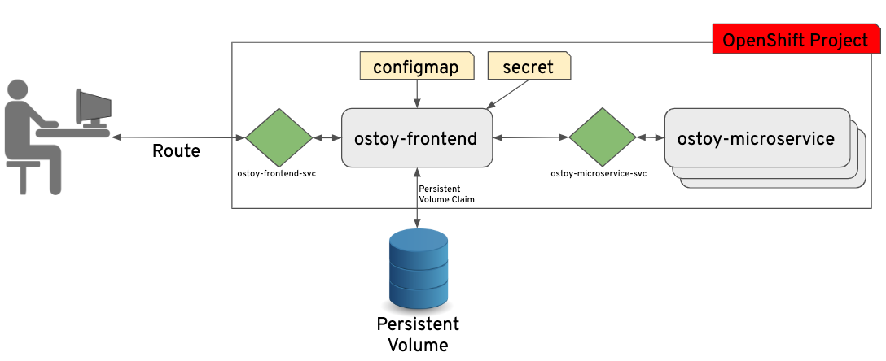
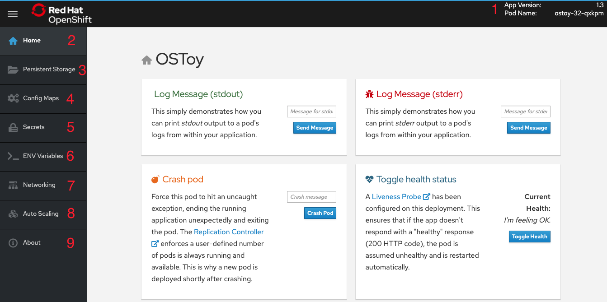

### About OSToy application

OSToy is a simple Node.js application that we will deploy to ROSA. It is used to help us explore the functionality of Kubernetes. This application has a user interface where you can:

- Write messages to the log (stdout / stderr)
- Intentionally crash the application to view self-healing
- Toggle a liveness probe and monitor OpenShift behavior
- Read config maps, secrets, and env variables
- If connected to shared storage, read and write files
- Check network connectivity, intra-cluster DNS, and intra-communication with an included microservice
- Increase the load to view automatic scaling of the pods to handle the load (via the Horizontal Pod Autoscaler)

### OSToy Application Diagram

### Familiarization with the Application UI

1. Shows the pod name that served your browser the page.
2. **Home:** The main page of the application where you can perform some of the functions listed which we will explore.
3. **Persistent Storage:**  Allows us to write data to the persistent volume bound to this application.
4. **Config Maps:**  Shows the contents of configmaps available to the application and the key:value pairs.
5. **Secrets:** Shows the contents of secrets available to the application and the key:value pairs.
6. **ENV Variables:** Shows the environment variables available to the application.
7. **Networking:** Tools to illustrate networking within the application.
8. **Auto Scaling:** Tool to increase the load of the pods and test the HPA.
9. Shows some more information about the application.
 

	