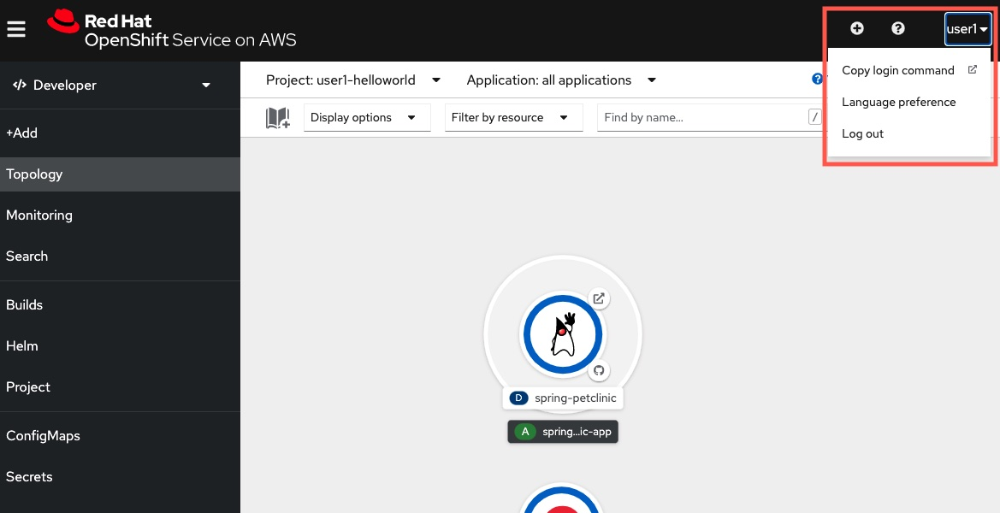
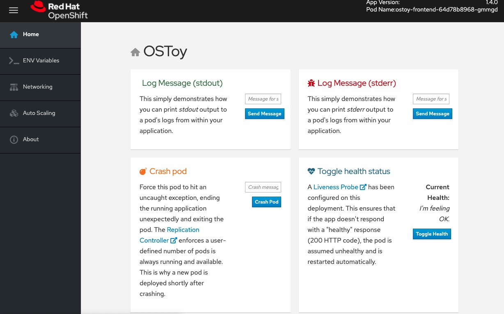

## Deploy via a Kubernetes Deployment

Although using web console to deploy apps sometimes is attractive, the best practice in using Kubenretes and OpenShift is always to leverage configuration-as-code concept. 

Kubernetes and OpenShift's all application configurations and definitions can be written in a YAML format, and then those YAML files can be treated as code and be placed inside a version control system like Git. Once the YAMLs are written, you apply those to Kubernetes or OpenShift, and the platform will continuously loop to check the definition against the current state. Uf something does not meet to definition, the platform will automatically do the work for you to meet the definition (or so called the desired state).

Thus, another way to deploy application would be to have the images for the app (like the front-end and back-end microservices) containers already created (for example, via CI/CD, but CI/CD is out of today's scope) and stored in an image repository. Then, you write YAMLs and apply them to OpenShift. We will do that now.

### 1. Retrieve the login command

Go back to you OpenShift web console, look at the console's top-right corner and you will see your username, click it, and then click `Copy login command`.

A new tab will open, and you may be asked to authenticate again.

Click `Display Token`.

Copy the command under where it says "Log in with this token". Then go to your terminal that was given and paste that command and press enter.

### 2. Create new project
Create a new project in your cluster by entering the following command:

    oc new-project <your-user-id>-ostoy

> <b>WARNING: Please replace <your-user-id\> with the user ID given by your instructor. DO NOT user other names to prevent naming conflict with other participants.</b>

You should receive the following response:

    $ oc new-project user1-ostoy

    Now using project "user1-ostoy" on server "https://api.osd4-demo.abc1.p1.openshiftapps.com:6443".

    You can add applications to this project with the 'new-app' command. For example, try:

        oc new-app centos/ruby-25-centos7~https://github.com/sclorg/ruby-ex.git

    to build a new example application in Ruby.

Equivalently you can also create this new project using the web console. Do you still remember how to create a new project via OpenShift web console? We have gone though this is the the first exercise!

### 3. Deploy the backend microservice

The microservice serves internal web requests and returns a JSON object containing the current hostname and a randomly generated color string.

In your terminal, deploy the microservice using the following command:

    oc apply -f https://raw.githubusercontent.com/peter-ho-redhat-demo/rosa-workshop-customized/master/rosa-workshop/app-deployment/yaml/ostoy-microservice-deployment.yaml

You should see the following response:

    $ oc apply -f https://raw.githubusercontent.com/peter-ho-redhat-demo/rosa-workshop-customized/master/rosa-workshop/app-deployment/yaml/ostoy-microservice-deployment.yaml

    deployment.apps/ostoy-microservice created
    service/ostoy-microservice-svc created

Please open the [URL](https://raw.githubusercontent.com/peter-ho-redhat-demo/rosa-workshop-customized/master/rosa-workshop/app-deployment/yaml/ostoy-microservice-deployment.yaml) that you apply to view the details of the YAML configuration of your back-end microservice app. The instructor will explain the YAML in words. Please consult the instructor or help if you are in doubt about the YAML.

### 4. Deploy the front-end service

The frontend deployment contains the Node.js frontend for our application along with a few Kubernetes objects (with an additional Route object, which helps to create a URL to expose the front-end outside OpenShift network).

In your terminal, deploy the front-end using the following command:

    oc apply -f https://raw.githubusercontent.com/peter-ho-redhat-demo/rosa-workshop-customized/master/rosa-workshop/app-deployment/yaml/ostoy-fe-deployment.yaml

You should see all objects created successfully

    $ oc apply -f https://raw.githubusercontent.com/peter-ho-redhat-demo/rosa-workshop-customized/master/rosa-workshop/app-deployment/yaml/ostoy-fe-deployment.yaml

    deployment.apps/ostoy-frontend created
    service/ostoy-frontend-svc created
    route.route.openshift.io/ostoy-route created

Please open the [URL](https://raw.githubusercontent.com/peter-ho-redhat-demo/rosa-workshop-customized/master/rosa-workshop/app-deployment/yaml/ostoy-fe-deployment.yaml) that you apply to view the details of the YAML configuration of your front-end app. The instructor will explain the YAML in words. Please consult the instructor or help if you are in doubt about the YAML.

### 5. Get the route and view the front-end application
Get the route so that we can access the application via: 
    
    oc get route

You should see the following response:

    NAME          HOST/PORT                                                 PATH   SERVICES             PORT    TERMINATION   WILDCARD
    ostoy-route   ostoy-route-ostoy.apps.my-rosa-cluster.g14t.p1.openshiftapps.com          ostoy-frontend-svc   <all>                 None

Copy the URL in the output (Note: different people will have different URL, as OpenShift will generate the URL based on the OpenShift project that the app is deployed on) above and paste it into your browser and press enter. You should see the homepage of our application.

> Note: If the page does not come up make sure that it is using `http` and **not** `https`. We will come back to make it https later.

