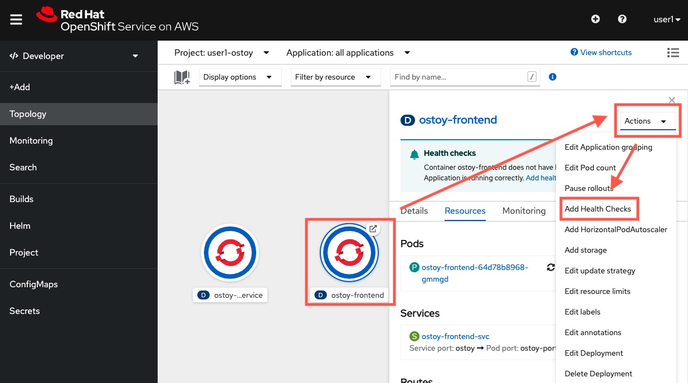
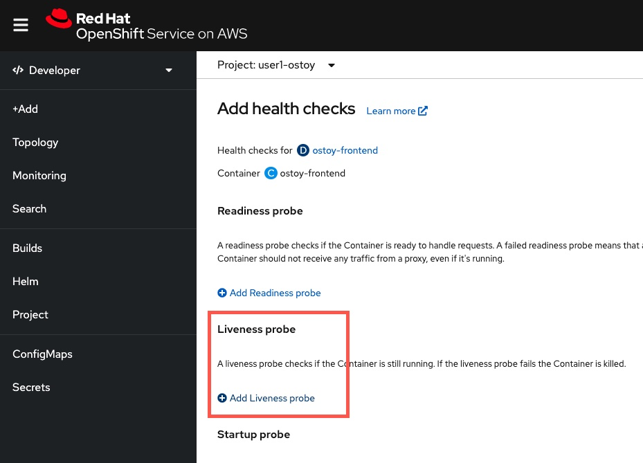
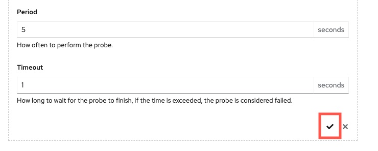
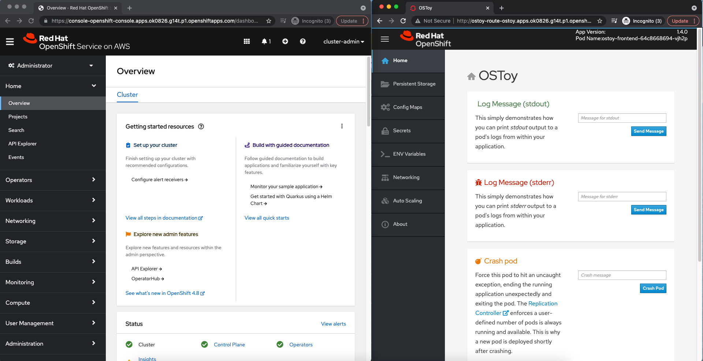
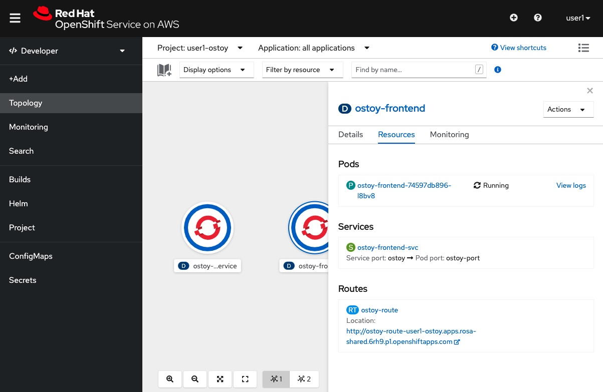
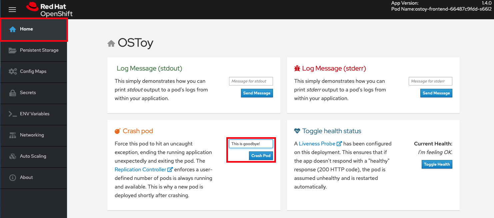
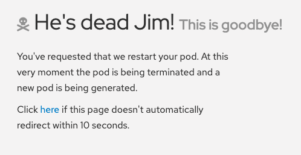
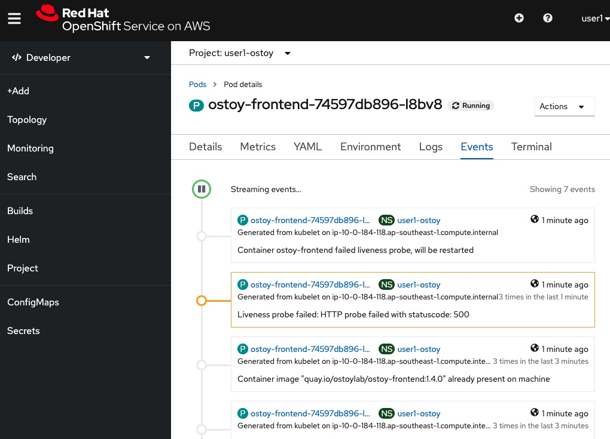

## Setting up health checks for your OSToy app

For an enterprise application to succeed, you need many moving parts to work correctly. If one piece breaks, the system must be able to detect the issue and operate without that component until it is repaired. Ideally, all of this should happen automatically.

Health probes are important in cloud-native and container workload applications. Kubernetes / OpenShift is able to detect process-level failure within a pod (such as a pod crashed), however, without defining a health probe, there is no way for Kubernetes / OpenShift to know any application-specific health checks (for example, the JVM process is still alive, but the HTTP always through 500 error, or fall into an infinite loop that cannot respond to traffic).

Our OSToy application deployed has NOT been configured to have a health probe check against the app's HTTP endpoints. The OSToy app has the /health path to act as the health check endpoint: whenever it returns 200, it is healthy, otherwise like 400 or 500 erros, then Kubernetes / OpenShift will treat it as non-healthy and restart the pod automatically to self-recover.

> Tips: In Enterprise and production environment, you app should expose something like /health endpoint that act as a dedicated health probe path, and when called, execute logics to check internally and return 200 HTTP if everything is fine. If your app does not have it, ask you app team to implement one.

### 1. Configure liveness health probe using OpenShift web console

Go back to your OpenShift web console, and make sure you are in the Developer view.

Click the `ostoy-frontend` application circle (Note: NOT the backend microservice, be careful NOT to pick the wrong one)

On the right-hand-side, there is an `Actions` button, click it, then click `Add Health Checks`.

In the page, you will see that you can configure 3 types of health probes. They are readiness probe, liveness probe and startup probe.

- Readiness probe: The probe will be called throughout the lifetime when the application runs. When this probe fails, OpenShift will automatically remove the pod from the networking configs (like the SDN) to prevent users accessing it. However, pod will not be terminated. It is especially useful to stop further traffic coming into the pod if the pod is overloaded, but still up-and-running.  

- Liveness probe: The probe will be called throughout the lifetime when the application runs. However, when this probe fails, OpenShift will instead consider the pod is dead and restart the pod. <b>We will use this today.</b>  

- Startup probe: The probe will only be called when the pod starts. The application will only be added to the OpenShift SDN when the startup probe succeed. Otherwise, the application will not be served. - It is very useful if the application needs a longer period of time to do pre-startup works.

Click the `+ Add Liveness Probe` button (the second one).

Enter the followings:

- Type: `HTTP GET`
- Path: `/health`
- Port: `8080`
- Initial delay: `10`
- Period: `5`

Click the `little check (i.e. tick) icon` within the dashed box of the Liveness probe.

Then, click the `Add` button at the bottom.

As you can see, the frond-end application will be terminated and restarted to make the health probe checking take effective. Now, you have successfully configured a liveness probe. Let's test this out.

### 2. Testing the OpenShift self-healing function and livessness probe

In this section, we will intentionally crash our pods, as well as make a pod non-responsive to the liveness probes and see how OpenShift behaves. 

We will first intentionally crash our pod and see that OpenShift will self-heal by immediately spinning it back up. Then we will trigger the health check by stopping the response on the `/health` endpoint in our app. After three consecutive failures OpenShift should kill the pod and then recreate it.

#### 2.1. Prepare the desktop
It would be best to prepare by splitting your screen between the OpenShift Web UI and the OSToy application so that you can see the results of our actions immediately.

But if the screen is too small or that just won't work, then open the OSToy application in another tab so you can quickly switch to OpenShift Web Console once you click the buttons in our app. 

Please make sure you have your OpenShift web console open. Then, in your Developer view, click the `ostoy-frontend` application circle (again, make sure you clicked the correct application). Then, click resources.

#### 2.2 Intentionally crash the pod
Go to the OSToy app (do you still remember how to access the app's URL? If not, please revisit the previous lab), click on `Home` in the left menu, and enter a message in the `Crash Pod` tile (e.g. "This is goodbye!") and press the `Crash Pod` button.

This will cause the pod to crash and OpenShift should restart the pod. After you press the button you will see:

#### 2.3. View the revival and OpenShift self-healing
Quickly switch to the Developer view. You will see that the pod is in an error state, meaning it is down but should quickly come back up. 

> Note: This may happen quickly. If you are switching tabs you might miss it.

This is the Kubernetes / OpenShift self-healing capability. Whenever it detects there are some failures inside the pod, it will automatically restart the pod for you to self-heal, and automatically schedule the pod in one of the OpenShift work node machines.

#### 2.4. Make the app malfunction to test the liveness probe
In the OSToy app click on the `Toggle Health` button, in the `Toggle Health Status` tile.  You will see the "Current Health" switch to "I'm not feeling all that well".

This will cause the app to stop responding with a "200 HTTP code". After 3 such consecutive failures, OpenShift will kill the pod and restart it.

To see this in action, click the Pod's name, then click `Events`. You will see something like below.

Congrats! Now you have tested the Openshift self-healing function and health probe!
