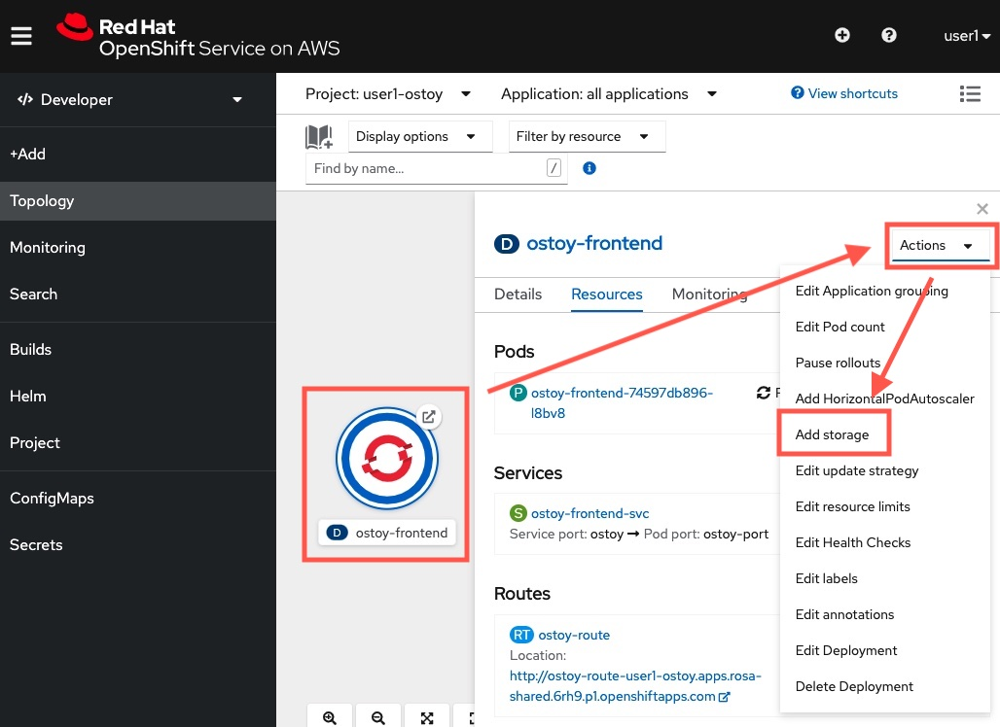
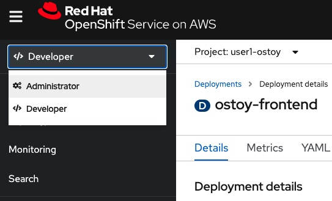
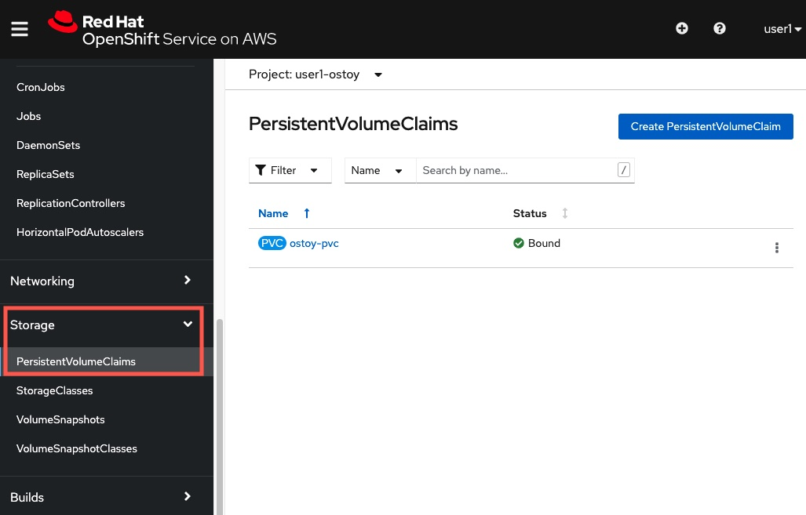
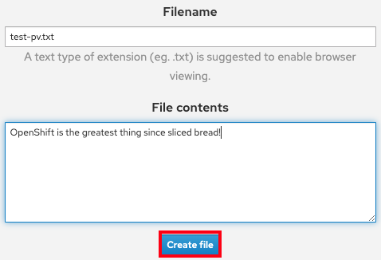
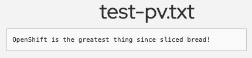
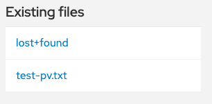

## Using Persistent Volumes

In this section, we will execute a simple example of using persistent storage by creating a file that will be stored on a Persistent Volume in our cluster and then confirm that it will "persist" across pod failures and recreation.

ROSA supports both EBS (Elastic Block Storage) and EFS (Elastic File Storage) for Persistent Volumes.

- [See here for information about using EFS in ROSA](https://docs.openshift.com/rosa/storage/persistent_storage/osd-persistent-storage-aws.html)

- [See here for information about using EBS in ROSA](https://docs.openshift.com/container-platform/4.8/storage/persistent_storage/persistent-storage-aws.html)

### 1. Dynamically create an AWS EBS storage for our OSToy app

Before we begin, we need to dynamically mount a storage to the application as the application itself does not persist data at this moment. To do that, ROSA has a direct integration with AWS storages like EBS (Elastic Block Storage), and ROSA has the ability to allocate storage and mount them to an app without asking you to go into AWS console to do the storage provisioning work. This mechanism in Kubernetes / OpenShift is called **dynamic volume provisoing**.

To start, go back to the Developer console view. Click the `ostoy-frontend` application circle again (once again, do NOT click the wrong one).

On the right-hand-side, click `Actions`, then click `Add storage`.

Input the followings:

- Persistent Volume Claim: Select `Create new claim`
- Storage class: `gp2`
- Persistent Volume Claim name: `ostoy-pvc`
- Access mode: `RWO`
- Size: `1 GiB`
- Volume mode: `File system`
- Mount path: `/var/demo_files`

Then click `Save` button.

Once it is done, your OSToy application will restart. Wait for OpenShift to communicate with AWS to provision an EBS storage for our OSToy application. When it is done, the circle shall show a deep blue color circle.

### 2. View the created Persistent Volume Claim
The created EBS storage is represented as a PersistentVolumeClaim object in OpenShift, which is like an interface between OpenShift and the underlying cloud storage.

Inside the OpenShift web UI, instead of viewing in Developer view, now click the `Developer` button on the left and change the view to `Administrator`.

Click on `Storage` on the left menu, then `PersistentVolumeClaims`. You will see our newly created stroage `ostoy-pvc`.  If you click on it, you will also see other information such as whether it is bound or not, size, access mode and age.

In this case the mode is RWO (Read-Write-Once) which means that the volume can only be mounted to one pod. As one option for Persistent Volumes in ROSA are backed by EBS it only supports RWO. If you want RWX (Read-Write-Many), consider using AWS EFS (Elastic File Storage).

> Hints: [See here for more info on access modes](https://docs.openshift.com/container-platform/4.8/storage/understanding-persistent-storage.html#pv-access-modes_understanding-persistent-storage)

### 3. Create a file to store inside the created AWS EBS
In the OSToy app, refresh to page.

Click on `Persistent Storage` on the left menu.  In the "Filename" area enter a filename for the file you will create (ie: `test-pv.txt`). Please use a **".txt"** extension so that the file will be visible in the browser.

Underneath that, in the "File Contents" box, enter text to be stored in the file. (e.g.: `OpenShift is the greatest thing since sliced bread!` or `test` :) ).  Then click "Create file".

### 4. View the file created
You will then see the file you created appear above, under "Existing files".  Click on the file and you will see the filename and the contents you entered.

### 5. Kill the pod
We now want to kill the pod and ensure that the new pod that spins up will be able to see the file we created. Exactly like we did in the previous section. 

Inside the OSToy app, click on `Home` button on the left menu.

Click on the `Crash pod` button. (You can enter a message if you'd like).

### 6. Ensure the file is still there
Once the pod is back and up, click on `Persistent Storage` on the left menu.

You will see the file you created is still there and you can open it to view its contents to confirm.

### 7. Verify the result via the container remote access
Now let's confirm that it's actually there by using the CLI and checking if it is available to the container. We mounted the directory `/var/demo_files` to our PVC.

To check, go back to your OpenShift web console, change it back to the `Developer` view.

Click the `ostoy-frontend` application circle agin. Click `Resources`, then click the pods's name.

Click `Terminal`.

Run the following to change the shell directory:

	cd /var/demo_files
	
If you enter `ls` you can see all the files you created.  Next, let's open the file we created and see the contents:

	cat test-pv.txt

You should see the text you entered in the UI. The whole flow would look like the below:
	
	$ cd /var/demo_files/

	$ ls
	lost+found   test-pv.txt

	$ cat test-pv.txt 
	OpenShift is the greatest thing since sliced bread!

Congrats! You have now added an AWS EBS into your application to persist any data written to your application's container!
