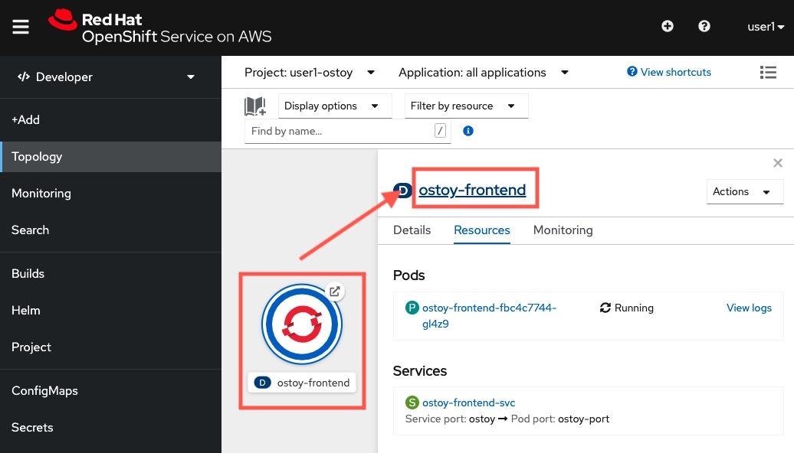

## ConfigMaps, Secrets and Environment Variables

In this section, we'll take a look at how OSToy can be configured using Secrets and Environment Variables.

Baking or hardcoding the configurations and secrets (e.g. password, connection strings) inside the application source code is a poor practice, and it will create security concerns as all developers are exposed to production environment credentials. As a best practice, applications should externalize any configurations and secrets. These configs and secrets can be put under OpenShift as ConfigMaps, Secrets and environment variables, and let OpenShift dynamically inject those settings back to the running application when the app starts.

### 1. Create a Secret
Kubernetes / OpenShift Secret objects allow you to store and manage sensitive information, such as passwords, OAuth tokens, and SSH keys. Putting this information in a secret is safer and more flexible than putting it, verbatim, into a Pod definition or a container image.

To create and associate a Secret object to our OSToy application, please go back to the Developer view, click Secrets on the left menu.

Click `Create` button, then select `Key/value secret`.

Input `ostoy-secret` as the secret name.

Create the following secret key/value pairs:

- Key: `secret.txt`
- Value:

    USERNAME=my_user 
    PASSWORD=@OtBl%XAp!#632Y5FwC@MTQk 
    SMTP=localhost 
    SMTP_PORT=25

Once done, click `Create`.

### 2. Mount the Secret to the application

Once created, click the `Add secret to workload` button.

Input the followings:

- Workload: `ostoy-frontend`
- Add secret as: `Volume`
- Mount path: `/var/secret`

Then click `Save` button. You will see the OSToy front-end application restarts to take the change effective.

Scroll down on the same page to the `Volume` section, you will see that the ostoy-secret has been mounted as files in the `/var/secret/` path inside the front-end application.

### 3. Verify the secret mounting

Go back to your OSToy applcation web page, refresh it. You shall be able to see a new Secrets session one the left's menu. Click it.

In this page, you will see the application is able to print back the secret.txt file that you have mounted. That proves that the secret has been mounted from the OpenShift to the container.

> Challenge yourself: try to remote access into the container, and see what's inside that mounted path.

### 4. Configuration using environment variables
Using environment variables is an easy way to change application behavior without requiring code changes. It allows different deployments of the same application to potentially behave differently based on the environment variables, and OpenShift makes it simple to set, view, and update environment variables for Pods/Deployments.

Go back to the OpenShift web console, make sure you are in the Developer view and in the Topology page. Again, click the `ostoy-frontend` application circle, then click the application name (ostoy-frontend) to enter the Deployment's detail page.

Click `Environment`. Here, you will be able to configure environment variables that the container see.

Let's add some environment variables. In the `Single values (env)` section, add the first variable:

- Key: `TESTING_VARIABLE_1`
- Value: `Hello`

Add another one (by clicling `Add more`):

- Key: `TESTING_VARIABLE_2`
- Value: `World`

Add another one (by clicking `Add more`):

- Key: `MICROSERVICE_NAME`
- Value: `OSTOY_MICROSERVICE_SVC`

> **Important: Make sure you set the MICROSERVICE_NAME environment variable, as we will use it later.**

Once it is done. Click `Save`.

### 4. Verify the enviornment variable injetion

Click `Topology` on the left. You shall notice that the application is restarting to make the change effective.

Once it is done (e.g. the circle shows a deep blue color), open the OSToy front-end application again and refresh, click `ENV Variables`.

Try to find it out: can you see `TESTING_VARIABLE_1` and `TESTING_VARIABLE_2` are on the list? If yes, then that means your container has collected the setting that you set in OpenShift!

> Challenge yourself again: try to remote access into the container, and try to print out the environment variables using shell commands. See what you will find!

Congrats! You have now injected OpenShift secrets into your container, and dynamically set the container's environment variable on OpenShift without application rebuild!