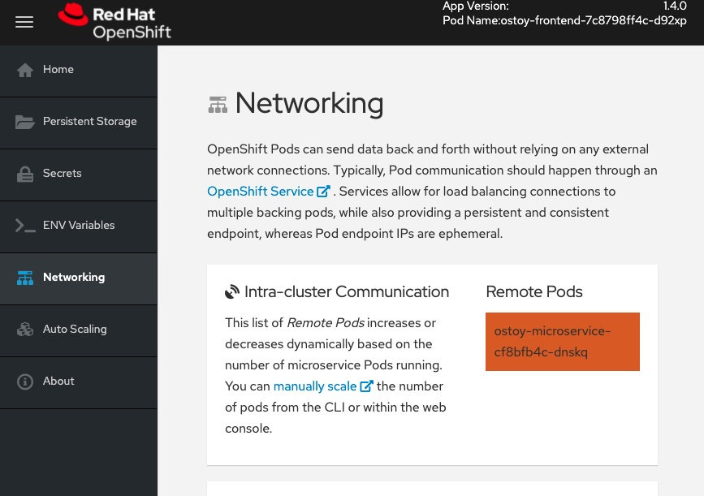
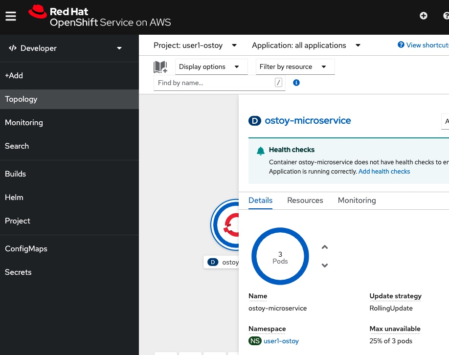
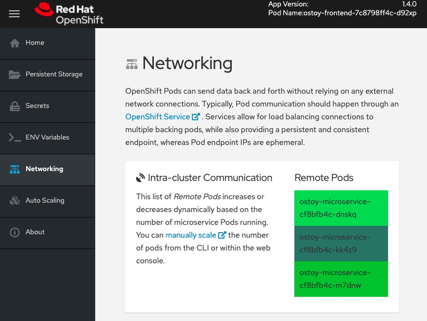
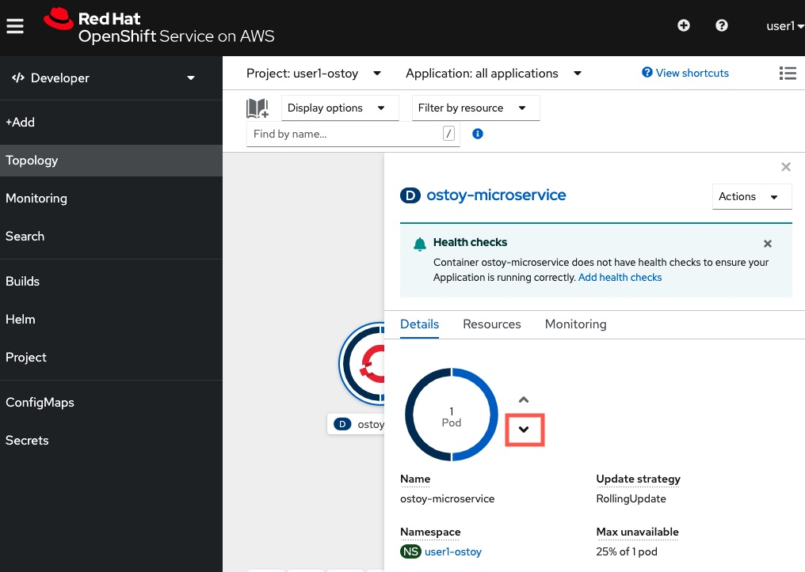
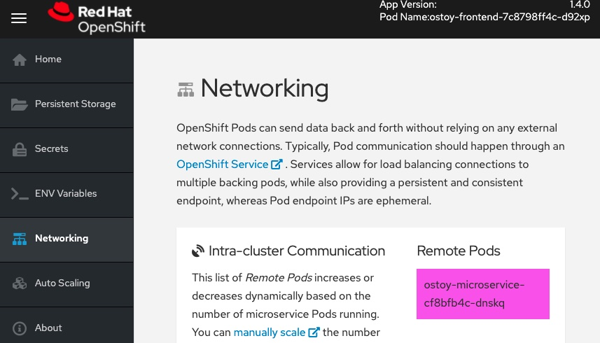
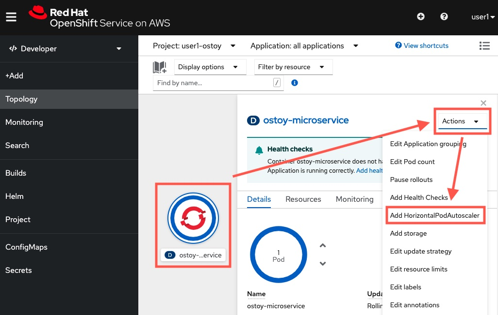
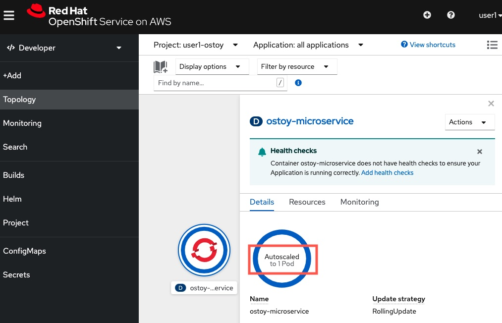
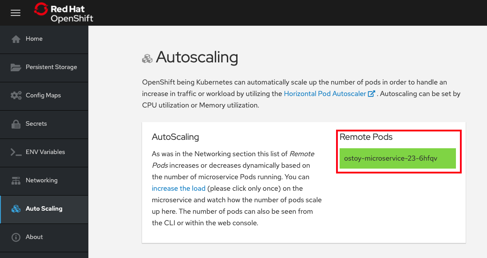
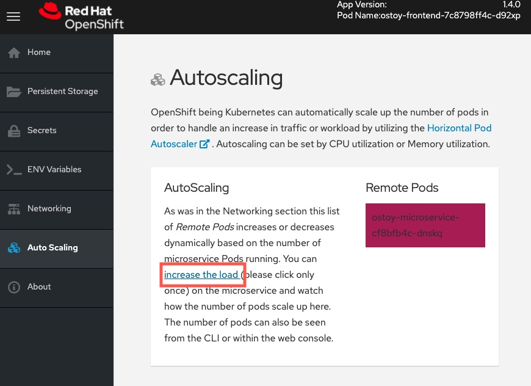
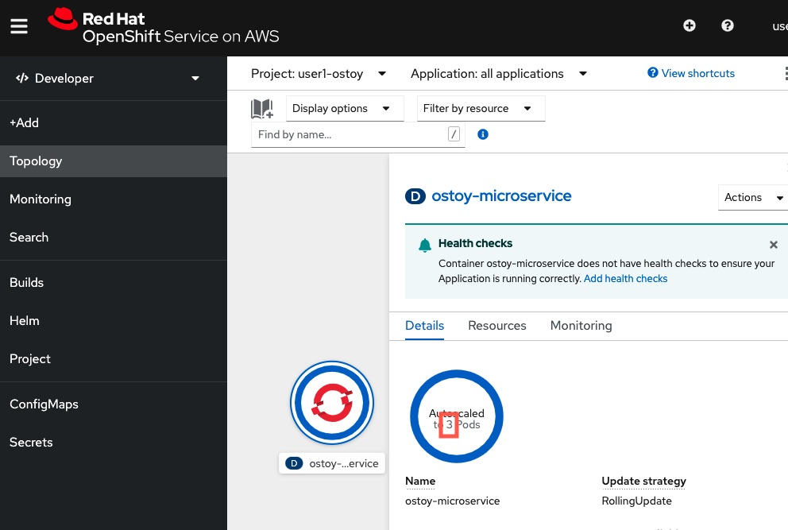

## Manual scaling

OpenShift allows one to scale up/down the number of pods for each part of an application as needed.  This can be accomplished via changing our Deployment definition (declarative), by the command line (imperative), or via the web UI (imperative). 

In our Deployment definition that we applied earlier, we stated that we only want one pod for our microservice to start with. This means that the Kubernetes Replication Controller will always strive to keep one pod alive. 

We can also define autoscaling based on load to expand past what we defined if needed which we will do in a later section of this lab.

Go to your OSToy application web application UI, click `Networking`. Under the `Intra-cluster Communication` section, you will see there is one box randomly changing colors. This box displays the randomly generated color sent to the frontend by our microservice along with the pod name that sent it. Since we see only one box that means there is only one microservice pod.

### 1. Confirm number of pods running via CLI
To confirm that we only have one pod running for our microservice, run the following command (or use the OpenShift web UI).

	oc get pods

You should see something like this:

	$ oc get pods

	NAME                                   READY     STATUS    RESTARTS   AGE
	ostoy-frontend-679cb85695-5cn7x       1/1       Running   0          1h
	ostoy-microservice-86b4c6f559-p594d   1/1       Running   0          1h

### 2. Scale pods via CLI

Now, we want to ostoy-microservice (note: NOT the frontend) to be scaled out to have 3 replica of pods. To do that, run the command below (or you can use the OpenShift web UI):

	oc scale deployment ostoy-microservice --replicas=3

Back to your OpenShift web console, on the Developer view and the Topology page, click the `ostoy-microservice` application circle. Confirm that there are now 3 pods. You can also run `oc get pods` again in CLI to confirm the change.

Now, to see this visually, go back to the OSToy application, click `Netoworking`, under the `Intra-cluster Communication` section, you will see there are 3 boxes randomly changing colors. 

### 3. Scale down via web UI
Let's use the web UI to scale back down to one pod.

Back to the OpenShift web console, in the Developer view, Topology page, click the `ostoy-microservice` application circle. On the right hand side, click `Details`, and then click the `down arrow` to scale the number of pods to 1.

Now, to see this visually, go back to the OSToy application, click `Netoworking`, under the `Intra-cluster Communication` section, you will see there are 1 box randomly changing colors. 

## Autoscaling

In this section, we will explore how the Horizontal Pod Autoscaler (HPA). It can be used and work within Kubernetes/OpenShift.

Horizontal Pod Autoscaler automatically scales the number of pods in a replication controller, deployment, replica set or stateful set based on observed CPU and/or memory utilization, or even some custom application metrics.

We will create an HPA and then use OSToy to generate CPU intensive workloads. We will then observe how the HPA will scale up the number of pods in order to handle the increased workloads.

### 1. Create the Horizontal Pod Autoscaler

We can create the HPA object using OpenShift web console, via CLI, or via YAML definition. This time, we will use the web console.

Back to your OpenShift web console, in the Developer view, click the `ostoy-microservice` application circle. On the right hand side, click `Actions`, then click `Add HorizontalPodAutoscaler`

Input the followings:

- Name: `ostoy-microservice-hpa`
- Minimum pods: `1`
- Maximum pods: `10`
- CPU Utilization: `80`

Click `Save`.

Roughly speaking, the HPA will increase and decrease the number of replicas (via the deployment) to maintain an average CPU utilization across all Pods of 80% (since we have set each pod requests 50 millicores in the orginal YAML definition, this means average CPU usage of 40 millicores).

### 2. View the current number of pods

In the OSToy app in the left menu click on "Autoscaling".

As was in the networking section you will see the total number of pods available for the microservice by counting the number of colored boxes. In this case we have only one. This can be verified through the web UI or from the CLI.

You can use the following command to see the running microservice pods only:

	oc get pods --field-selector=status.phase=Running | grep microservice

or visually in our application:

### 3. Increase the load

Now that we know that we only have one pod let's increase the workload that the pod needs to perform. Click the link in the center of the card that says "increase the load".  <u>**Please click only *ONCE*!!!!**</u>

This will generate some CPU intensive calculations.  (If you are curious about what it is doing you can click [here](https://github.com/openshift-cs/ostoy/blob/master/microservice/app.js#L32)).

> **Note: The page may become slightly unresponsive.  This is normal; so be patient while the new pods spin up.**

### 4. See the pods scale up

After about a minute the new pods will show up on the page (represented by the colored rectangles). Confirm that the pods did indeed scale up through the OpenShift Web Console or the CLI.

> **Note: The page may still lag a bit which is normal.**

Congrats! You have scaled your application manually or automatically via HPA configuration.