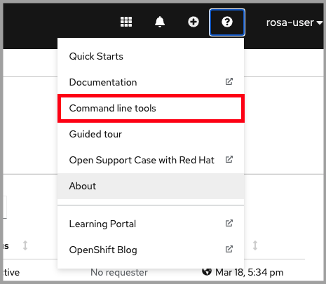
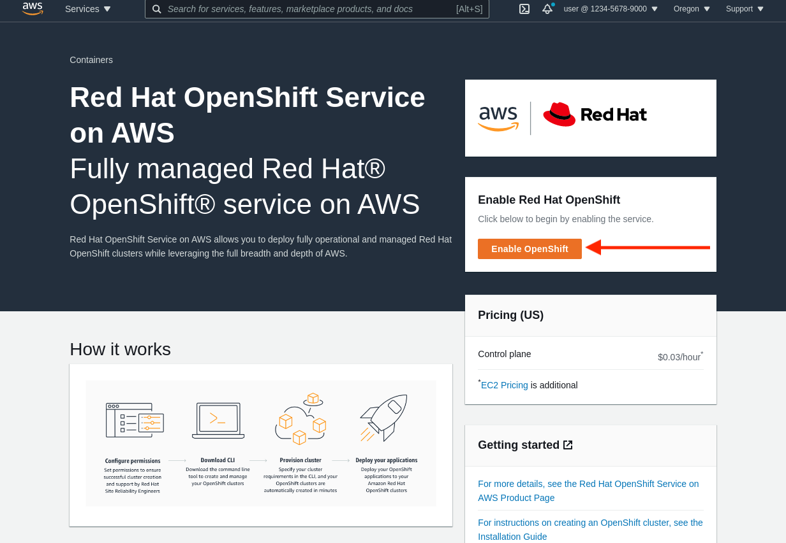
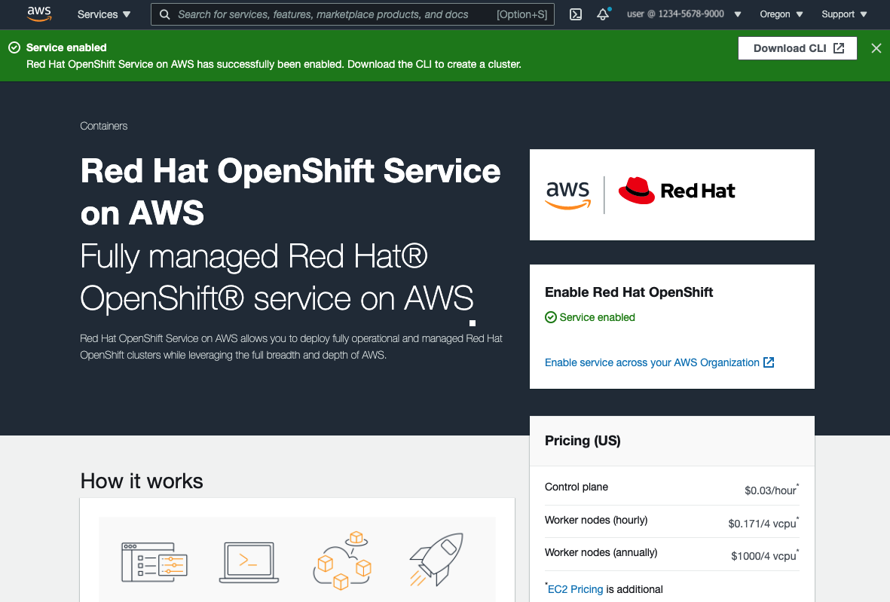

There are currently two supported methods for creating a ROSA cluster. One method uses IAM with the *AdministratorAccess* policy (only for the account using ROSA).  The other, more recent version, uses AWS Secure Token Service (STS) for the ROSA cluster components. AWS STS is a global web service that allows the creation of temporary credentials for IAM users or federated users. ROSA uses this to assign IAM roles short-term, limited-privilege, security credentials. These credentials are associated with IAM roles that are specific to each component that makes AWS API calls. This better aligns with principals of least privilege and is much better aligned to secure practices in cloud service resource management. In this workshop, we will be using the STS method.

## Prerequisites

Please read through the followings. To save your time, most of the preprequistes have been prepared by our team for you to conduct this hands-on exercise. In case you are really interested, you can find more details in the ROSA documentation at [Prerequisites for ROSA w/STS](https://docs.openshift.com/rosa/rosa_getting_started_sts/rosa-sts-aws-prereqs.html).

### AWS Credentials
You will need the following pieces of information from your AWS account **(All of the below items have already been prepared by us. Thus, you don't have to do anything)**:

- AWS IAM User
- AWS Access Key ID
- AWS Secret Access Key
- AWS Account with sufficient resource quota

### Red Hat Account
To create a ROSA cluster, you must have a Red Hat account to register your ROSA cluster into Red Hat's cloud console. In this workshop, we will be providing you the Red Hat account with a token that is ready for ROSA creation. Thus, **you don't need to create an account for today's workshop**. However, if you are interested, create one here <https://console.redhat.com/>. Accept the required terms and conditions. Then check your email for a verification link.

### Install the AWS CLI
AWS CLI will be used for logging into your assigned AWS account. The AWS account has already been created by our team. Each participant will be given a web-based terminal, which has all the necessary CLI tools being installed (including the AWS CLI). Thus, **you don't have to install AWS CLI on your own laptop**. However, if you are interested, please check out the [Install the AWS CLI](https://aws.amazon.com/cli/) documentation.

### Install the ROSA CLI
AWS CLI itself cannot create a ROSA cluster. Instead, ROSA CLI will be used for cluster creation and management. Just like what has been mentioned, all the necessary CLI tools being installed (including the ROSA CLI). Thus, **you don't have to install ROSA CLI on your own laptop**. 

However, if you are interested, please check out the [ROSA CLI](https://www.openshift.com/products/amazon-openshift/download) page to download. Here are some steps to install ROSA CLI.
- Install the ROSA CLI as per your operating system. 
- Download and extract the relevant file for your operating system and store it in a location within your "PATH". 
- Run `rosa version` to make sure it works and that it returns the version number.

### Install the OpenShift CLI
Again, **the web-based terminal that we provide today has all the necessary CLI tools being installed (including the OpenShift CLI)**. Thus, you don't have to install OpenShift CLI on your own laptop. However, if you are interested to learn how to install. There are a few ways to install the `oc` CLI:

- If you have the `rosa` CLI installed, the simplest way is to run `rosa download oc`. Once downloaded, move the executable into a directory in your PATH
- You can [download and install](https://docs.openshift.com/container-platform/4.8/cli_reference/openshift_cli/getting-started-cli.html#installing-openshift-cli) the latest OpenShift CLI (oc).  
- If you already have an OpenShift cluster you can access the command line tools page by clicking on the *Question mark > Command Line Tools*.  Then download the relevant one for your operating system.

  

**Why use `oc` over `kubectl`** 
Being Kubernetes, one can definitely use `kubectl` with their OpenShift cluster.  `oc` is specific to OpenShift in that it includes the standard set of features from `kubectl` plus additional support for OpenShift functionality.  See [Usage of oc and kubectl commands](https://docs.openshift.com/container-platform/4.8/cli_reference/openshift_cli/usage-oc-kubectl.html) for more details.

### Enable ROSA
Complete this step if you have *not* enabled ROSA in your AWS account (for the sake of time, **we have already enabled the ROSA service in the AWS accounts that we provide**):

- Visit <https://console.aws.amazon.com/rosa> to enable your account to use ROSA.
- Click on the orange "Enable OpenShift" button on the right.

    

- It will take about a minute and then you will see a green "service enabled" bar at the top.

    

### Configure the AWS CLI
Although the AWS CLI is already installed in your web-based terminal, it has NOT been configured to use any AWS account. **Please follow these steps in the terminal**:

1. Enter `aws configure` in the terminal
2. Enter the AWS Access Key ID and press enter
3. Enter the AWS Secret Access Key and press enter
4. Enter the region (**please use `ap-southeast-1`**, which is Singapore) you want to deploy into (you may want to deploy the ROSA in other regions like Hong Kong `ap-east-1`, technically it is feasible as ROSA is available in Hong Kong. *However, please DO NOT try to use other regions unless the instructor say so, as we did not setup enough AWS quota resources in other AWS regions*)
5. Enter the output format you want (“table” or “json”).  For this guide you can choose “table” as it is easier to read but either is fine.

### Verify the AWS CLI configuration
Verify that the configuration is correct.

1. Run the following command to query the AWS API      

        aws sts get-caller-identity

2. You should see a table (or JSON if that’s what you set it to above) like the below.  Verify that the account information is correct.

        $ aws sts get-caller-identity
        ------------------------------------------------------------------------------
        |                                GetCallerIdentity                           |
        +--------------+----------------------------------------+--------------------+
        |    Account   |                   Arn                  |        UserId      |
        +--------------+----------------------------------------+--------------------+
        |  000000000000|  arn:aws:iam::00000000000:user/myuser  |  AIDA00000000000000|
        +--------------+----------------------------------------+--------------------+

### Log into your Red Hat account
1. Enter `echo $ROSA_INSTALL_TOKEN` in the terminal. We have injected our Red Hat account's token into your terminal environment, so that you don't need to create your own Red Hat account. (Note: **Please DO NOT use your own Red Hat account foor this workshop, as we cannot help you to manage the lifecycle of the cluster in the workashop. Use the token we provide.**)
2. Enter `rosa login` in a terminal.
3. It will prompt you to open a web browser, you don't have to do that because we already have the token in your environment.
4. Copy the token echoed above and paste it back into the CLI prompt and press enter.  

### Verify Red Hat login and AWS account credentials
Verify that all the credentials set up are correctly. 

1. Run `rosa whoami`

    You should see an output like below:

        AWS Account ID:               000000000000
        AWS Default Region:           ap-southeast-1
        AWS ARN:                      arn:aws:iam::000000000000:user/myuser
        OCM API:                      https://api.openshift.com
        OCM Account ID:               1DzGIdIhqEWy000000000000000
        OCM Account Name:             Your Name
        OCM Account Username:         you@domain.com
        OCM Account Email:            you@domain.com
        OCM Organization ID:          1HopHfA20000000000000000000
        OCM Organization Name:        Red Hat
        OCM Organization External ID: 0000000

2. Please check all information for accuracy before proceeding.

### Verify AWS account quota
Verify that your AWS account has enough quota in the region you will be deploying your cluster to (which should be sufficient as Red Hat as pre-requested to increase AWS account quota before we begin the workshop). Run the following: 

    rosa verify quota

Should return a response like

    I: Validating AWS quota...
    I: AWS quota ok. If cluster installation fails, validate actual AWS resource usage against https://docs.openshift.com/rosa/rosa_getting_started/rosa-required-aws-service-quotas.html

### Verify `oc` CLI
Verify that the `oc` CLI is installed correctly

    rosa verify openshift-client

We have now successfully set up our account and environment and are ready to deploy our cluster in the next step.
