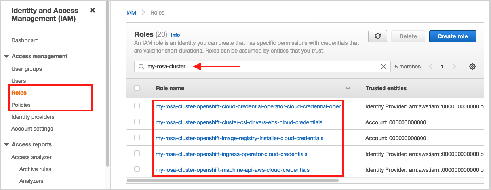

## Deleting a ROSA Cluster

To delete a ROSA cluster follow the steps below.

1. If you need to list your clusters in order to make sure you are deleting the correct one run

		rosa list clusters

1. Once you know which one to delete run

		rosa delete cluster --cluster=<clustername>

1. It will prompt you to confirm that you want to delete it. Press “y” then enter. The cluster will be deleted and all its associated infrastructure. **THIS IS NON-RECOVERABLE.**

	> Note: All AWS STS/IAM roles and policies will remain and must be deleted manualy once the cluster deletion is complete.

1. Once complete, you may then delete the:
	* Cluster roles
	* Policies
	* OIDC Providers

	This can be done via the `aws` CLI or from the AWS web console. These can be found under IAM > Roles or Policies or Identity providers > search for your cluster name.

	

1. The remaining roles would be account-scoped and should only be removed if they are <u>no longer needed by other clusters in the same account</u>. To delete these search for "ManangedOpenShift" or your specified prefix (if specified).

*[ROSA]: Red Hat OpenShift Service on AWS
*[IdP]: Identity Provider
*[OCM]: OpenShift Cluster Manager
*[STS]: AWS Secure Token Service