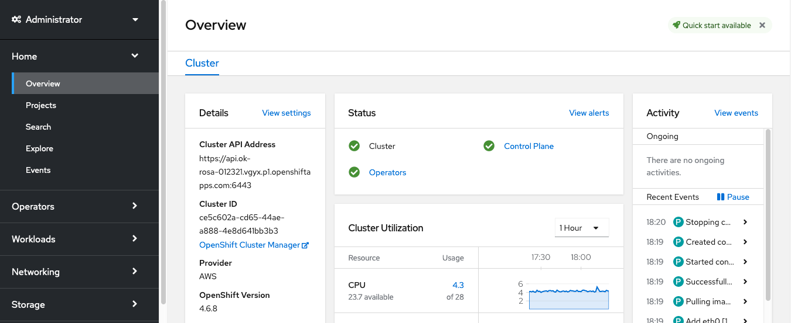
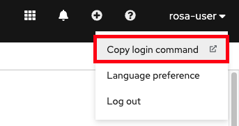
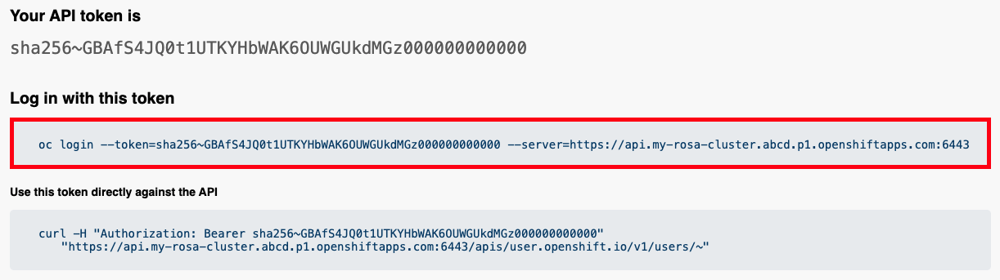

If you want to be able to access your cluster immediately through a cluster-admin user, you can follow these steps. This is good if you need quick access to the cluster. Though the recommended approach is to use a formal identity provider to access the cluster (and then grant that user admin privileges, if desired).

Run this command to create the admin user:

    rosa create admin --cluster=<your-user-id>-rosa

You will see a response like the following:

    W: It is recommended to add an identity provider to login to this cluster. See 'rosa create idp --help' for more information.
    I: Admin account has been added to cluster 'my-rosa-cluster'. It may take up to a minute for the account to become active.
    I: To login, run the following command:
    oc login https://api.my-rosa-cluster.abcd.p1.openshiftapps.com:6443 \
        --username cluster-admin \
        --password FWGYL-2mkJI-00000-00000

**Note: Please copy and save the username and password from the CLI output. We will use that later.**

## Accessing the cluster via web console

There are multiple ways to interact with your cluster. You can connect to it via the CLI or via the Web Console. We will review both options below.

1. Enter the console URL into your web browser.  If you need to retrieve it you can run:

        rosa describe cluster -c <your-user-id>-rosa | grep Console

2. Login using the cluster-admin username and password that you generated in your previous lab.

3. You should be logged in. You should see a web console like the following with the "Administrator" panel visible.

    

## Accessing the cluster via the CLI

In order to access the cluster via the CLI you must have the `oc` CLI installed. We have already installed the `oc` command in your terminal environment. So no worries.

1. Log into the web console as stated above.
2. Click on your username in the top right corner.
3. Click on `Copy Login Command`.

    

4. This will open a new tab and probably ask you to login again.
5. A new tab will open, Click on `Display token`.
6. You will see a page like the following:

    

7. Copy the `oc login` command and paste it into your terminal. Press enter

        $ oc login --token=sha256~GBAfS4JQ0t1UTKYHbWAK6OUWGUkdMGz000000000000 --server=https://api.my-rosa-cluster.abcd.p1.openshiftapps.com:6443
        
        Logged into "https://api.my-rosa-cluster.abcd.p1.openshiftapps.com:6443" as "rosa-user" using the token provided.
        
        You have access to 79 projects, the list has been suppressed. You can list all projects with ' projects'
        
        Using project "default".

8. We can confirm that we are now the user we logged in with by running `oc whoami`:

        $ oc whoami
        
        rosa-user

9. We can start using our cluster.