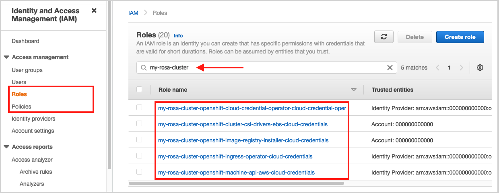

## Deleting a ROSA Cluster

To delete a ROSA cluster follow the steps below.

1. Run the following:

		rosa delete cluster --cluster=<your-user-id>-rosa

1. It will prompt you to confirm that you want to delete it. Press “y” then enter. The cluster will be deleted and all its associated infrastructure. **THIS IS NON-RECOVERABLE.**

	> Note: All AWS STS/IAM roles and policies will remain and must be deleted manualy once the cluster deletion is complete.

1. Once complete, you may then delete the:
	* Cluster roles
	* Policies
	* OIDC Providers

	This can be done via the `aws` CLI or from the AWS web console. These can be found under IAM > Roles or Policies or Identity providers > search for your cluster name.

	

1. The remaining roles would be account-scoped and should only be removed if they are <u>no longer needed by other clusters in the same account</u>. To delete these search for "ManangedOpenShift" or your specified prefix (if specified).